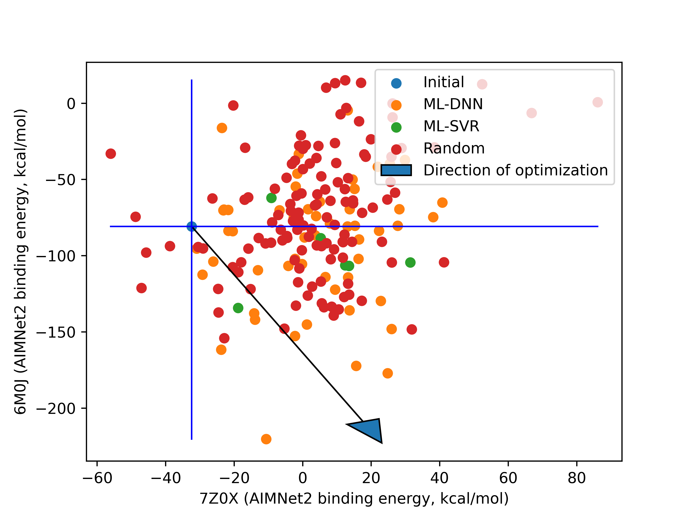
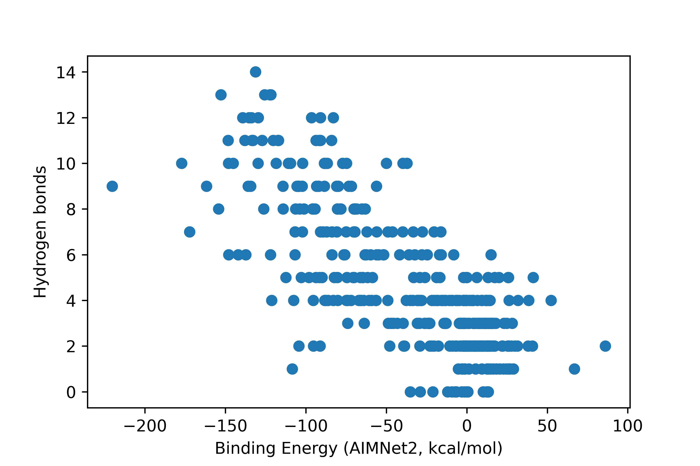
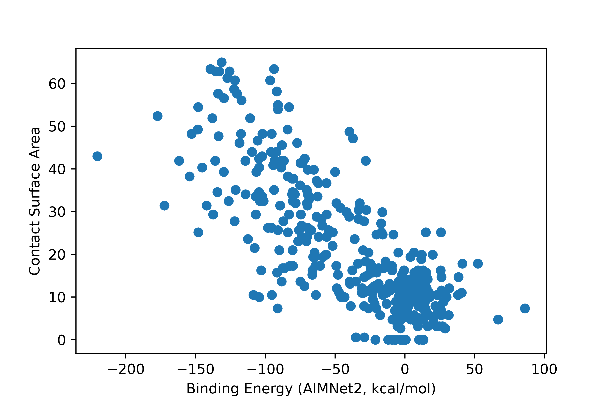

# Protein Design

*Setup, in order to utilize this program you will have to create a .env file in the root folder (see .env.example*


### The source code is broken down into 3 major components:
1) measure_interface (main.py) - a tool for retreiving PDB's from RCSB, generating their topologies (with psfgen), identifying interfaces, making measurements etc. This is the MD and MD analytical class.

Example functionality:
```python
device = torch.device('cpu')
# For AIMNet backend
torch.backends.cuda.matmul.allow_tf32 = False
torch.backends.cudnn.allow_tf32 = False
    
Data = load_data_from_api() # Load or create our Data.json main database file
Complex_7Z0X = measure_interface("7Z0X", device)
Complex_6M0J = measure_interface("6M0J", device) # Will download the pdb and process it if it is not found
Complex.Minimize() # Will run a NAMD simulation based on the contents of Minimize.namd in the root folder
Complex.load_universe() # Will load the last frame of the minimization by default
Complex.FindInterface() # Find the corresponding Receptor interface resids based on their distance to the Spike protein interface residues
Complex.BuildInterface() # Build the MDAnalsis and ASE models of the spike and receptor interfaces

Complex.MeasureInterface() # Measure binding energy, hydrogen bonding and contact surface area at the interface
entry = {"Source": "Inital"}
entry.update(Complex.score)
post_entry_to_api(Data, idx, Complex.interface_seq, entry) # Write the results to the main database
```

1.1) contactarea - A tool for measuring interface contact area, using a type of invererted SASA measurement on the Spike interface ase model and Receptor interface ase model.
```python
surface_contact = contactarea(radii_csv = "Alvarez2013_vdwradii.csv")
ContactSurfaceArea = surface_contact.calculate(Spike_ase, Receptor_ase)
```

2) Transformer - A neural network transformer that converts the interface sequences to integer representations and attempts to learn the long range relationships between amino acids on the spike protein interface which contribute towards and against binding with the antibody and the ACE2 receptor. A train-test split is used to provide early stopping based on a test which helps to avoid overfitting.

```python
device = torch.device("cuda")
with open("Data.json") as jin:
    Data = json.load(jin)

for target in ["7Z0X", "6M0J"]:
    train_dataloader, test_dataloader, Min_val, Max_val = encode_data(Data, target, device)

    models = {}
    models[target], _ = train_transformer_model(device, train_dataloader, test_dataloader, Min_val, Max_val, checkpoint_fname=f"best_{target}.pt")
```


Largely addapted from: [https://doi.org/10.1002/advs.202301544](https://doi.org/10.1002/advs.202301544)

3) Active learning (ML.py) - Using measure_interface and the transformers to iteratively train -> predict -> test new sequence mutations to optimize towards less binding affinity between Prot_A-Prot_B and the same or more binding affinity between Prot_A-Prot_C.

```python
device = torch.device('cpu')

Data = load_data_from_api()

# Load the RCSB minimized structures
Complex_7Z0X = measure_interface("7Z0X", torch.device("cpu")) # struggling to hold all these models in GPU memory so we'll use CUDA in some place and not in other
Complex_6M0J = measure_interface("6M0J", torch.device("cpu"))


# Active machine learning
for active_learning_iteration in range(1000):
    # Reset the active folder to the wild type
    for Complex in [Complex_6M0J, Complex_7Z0X]:
        Complex.active_folder = f"MD/{Complex.idx}"
        Complex.load_universe()
        Complex.FindInterface()
        Complex.BuildInterface()

    # Load database again, do it very time incase multiple instance are runnign
    Data = load_data_from_api()
    # Train models from last best checkpoint
    models = {}
    for idx in ["7Z0X", "6M0J"]:
        train_dataloader, test_dataloader, Min_val, Max_val = encode_data(Data, idx, device)
        models[idx], _ = train_transformer_model(device, train_dataloader, test_dataloader, Min_val, Max_val, checkpoint_fname=f"best_{idx}.pt")

    # Generate a bunch of potential new sequences to test and select the best on using ML
    candidates = []
    while len(candidates) < 100:
        while Complex_6M0J.interface_seq in Data["6M0J"] or Complex_6M0J.interface_seq in candidates:
            #print(Complex_6M0J.interface_seq, "found in Data, mutating")
            if len(candidates) % 10 == 0:
                Complex_6M0J.reset_seq()
            Complex_6M0J.Mutate()
        candidates.append(Complex_6M0J.interface_seq)
    X_test = make_data(candidates, src_len).squeeze().to(device)
    
# Make prediction of binding energy with transformer
print("Predicting binding energies for candidate sequences")
candidates_pred = pandas.DataFrame(index=candidates)
for idx in ["7Z0X", "6M0J"]:
    candidates_pred[idx] = models[idx](X_test).flatten().cpu().detach().numpy()
candidates_pred["score"] = candidates_pred["6M0J"] + -(candidates_pred["7Z0X"]*2) # put more importance on loss of binding to 7Z0X
candidates_pred = candidates_pred.sort_values("score")

# Run the choice
choice = candidates_pred.iloc[0].name
Complex_7Z0X.interface_seq = Complex_6M0J.interface_seq = choice
for Complex, idx in zip([Complex_7Z0X, Complex_6M0J], ["7Z0X", "6M0J"]):
    Complex.MakeMutation() # Actualise the mutated interface_seq
    Complex.Minimize()
    if not os.path.exists(f"{Complex.active_folder}/Minimization.coor"):
        print("Minimization failed, skipping")
        continue
    Complex.load_universe()
    Complex.FindInterface() 
    Complex.BuildInterface()
    #Make measurements and store them
    print("Measuring the resulting interface")
    Complex.MeasureInterface()
    Data = load_data_from_api() # always reload before posting incase there is new data from another source
    entry = {"Source": "ML-DNN"}
    entry.update(Complex.score)
    post_entry_to_api(Data, idx, Complex.interface_seq, entry)
```





#### Post-script

Bingind energy was used as the measurement of binding affinity between the interfaces, this measured is one of many that could be made. It does track with other measurements of binding affinity such as hydrogen bonding and contact surface area which is a good sign that it is providing some useful insight.




