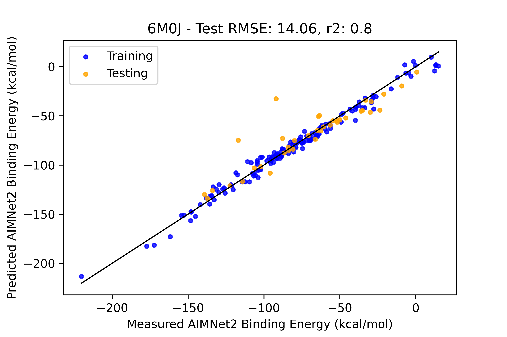
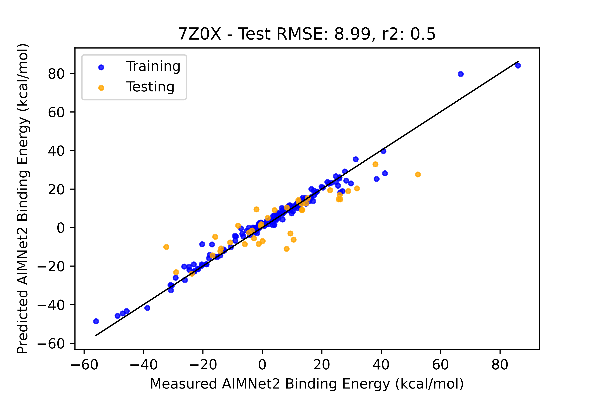

# Protein Design

*Setup, in order to utilize this program you will have to create a .env file in the root folder (see .env.example*


### The source code is broken down into 3 major components:
1.  measure_interface (main.py) - a tool for retreiving PDB's from RCSB, generating their topologies (with psfgen), identifying interfaces, making measurements etc. This is the MD and MD analytical class.

Example functionality:
```python
device = torch.device('cpu')
# For AIMNet backend
torch.backends.cuda.matmul.allow_tf32 = False
torch.backends.cudnn.allow_tf32 = False
    
Data = load_data_from_api() # Load or create our Data.json main database file
Complex_7Z0X = measure_interface("7Z0X", device)
Complex_6M0J = measure_interface("6M0J", device) # Will download the pdb and process it if it is not found
Complex.Minimize() # Will run a NAMD simulation based on the contents of Minimize.namd in the root folder
Complex.load_universe() # Will load the last frame of the minimization by default
Complex.FindInterface() # Find the corresponding Receptor interface resids based on their distance to the Spike protein interface residues
Complex.BuildInterface() # Build the MDAnalsis and ASE models of the spike and receptor interfaces

Complex.MeasureInterface() # Measure binding energy, hydrogen bonding and contact surface area at the interface
entry = {"Source": "Inital"}
entry.update(Complex.score)
post_entry_to_api(Data, idx, Complex.interface_seq, entry) # Write the results to the main database
```

1.1 contactarea - A tool for measuring interface contact area, using a type of invererted SASA measurement on the Spike interface ase model and Receptor interface ase model.
```python
surface_contact = contactarea(radii_csv = "Alvarez2013_vdwradii.csv")
ContactSurfaceArea = surface_contact.calculate(Spike_ase, Receptor_ase)
```

2. Transformer - A neural network transformer that converts the interface sequences to integer representations and attempts to learn the long range relationships between amino acids on the spike protein interface which contribute towards and against binding with the antibody and the ACE2 receptor. A train-test split is used to provide early stopping based on a test which helps to avoid overfitting.

```python
device = torch.device("cuda")
with open("Data.json") as jin:
    Data = json.load(jin)

for target in ["7Z0X", "6M0J"]:
    train_dataloader, test_dataloader, Min_val, Max_val = encode_data(Data, target, device)

    models = {}
    models[target], _ = train_transformer_model(device, train_dataloader, test_dataloader, Min_val, Max_val, checkpoint_fname=f"best_{target}.pt")
```




Largely addapted from: [https://doi.org/10.1002/advs.202301544](https://doi.org/10.1002/advs.202301544)